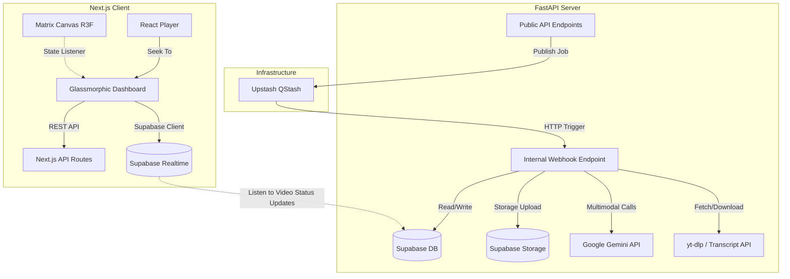

# TubeRAG Architectural Design Specification

This document defines the architecture, data models, API endpoints, and design details for **TubeRAG**, a production-ready SaaS platform that allows users to perform semantic search and Retrieval-Augmented Generation (RAG) over YouTube videos with interactive video timeline deep-linking.

---

## 1. System Architecture Overview

TubeRAG is structured as a monorepo consisting of:
*   **`/frontend`**: A Next.js 16 (App Router) web app optimized with Turbopack, Tailwind CSS, shadcn/ui components, Framer Motion, GSAP, and a background 3D canvas built with React Three Fiber (R3F) and `@react-three/drei`.
*   **`/backend`**: A FastAPI application deployed on FastAPI Cloud, using Python 3.11+, Supabase (pgvector) as the database and vector store, and Upstash QStash as the serverless HTTP message queue.

All API communication, data models, and typings are synchronized between the client and server.



---

## 2. Supabase Database & Vector Schema

We utilize the `pgvector` extension for storing and querying text embeddings. The vector size is configured to **768 dimensions**, matching Google's `text-embedding-004` model.

```sql
-- Enable pgvector extension
create extension if not exists vector;

-- Videos table
create table public.videos (
    id uuid default gen_random_uuid() primary key,
    user_id uuid references auth.users(id) on delete cascade not null,
    youtube_id varchar(255) not null,
    title text,
    channel_name varchar(255),
    duration double precision,
    thumbnail_url text,
    status varchar(50) default 'pending', -- pending, transcribing, processing_frames, completed, failed
    current_offset double precision default 0.0,
    error_message text,
    created_at timestamp with time zone default timezone('utc'::text, now()) not null,
    updated_at timestamp with time zone default timezone('utc'::text, now()) not null,
    unique(user_id, youtube_id)
);

-- Playlists (folders) table
create table public.playlists (
    id uuid default gen_random_uuid() primary key,
    user_id uuid references auth.users(id) on delete cascade not null,
    name varchar(255) not null,
    created_at timestamp with time zone default timezone('utc'::text, now()) not null,
    unique(user_id, name)
);

-- Playlist-Video Join table
create table public.playlist_videos (
    playlist_id uuid references public.playlists(id) on delete cascade not null,
    video_id uuid references public.videos(id) on delete cascade not null,
    primary key (playlist_id, video_id)
);

-- Video Chunk Embeddings (Transcript & Frame analysis)
create table public.video_chunks (
    id uuid default gen_random_uuid() primary key,
    video_id uuid references public.videos(id) on delete cascade not null,
    content text not null,
    embedding vector(768) not null,
    start_time double precision not null,
    end_time double precision not null,
    chunk_type varchar(50) not null, -- 'transcript' | 'visual_frame'
    image_url text, -- Storage URL populated if chunk_type = 'visual_frame'
    created_at timestamp with time zone default timezone('utc'::text, now()) not null
);

-- Indexes for performance
create index on public.video_chunks using hnsw (embedding vector_cosine_ops);
create index idx_chunks_video_id on public.video_chunks(video_id);
```

---

## 3. Ingestion Pipeline & QStash Integration (State Machine)

To handle long-form videos up to 3 hours without timing out serverless execution containers, ingestion is processed iteratively using cursor-based offsets driven by Upstash QStash.

### Stage 1: Request Ingestion (`POST /api/v1/ingest`)
*   Frontend posts a YouTube URL: `{ "url": "https://youtube.com/..." }`.
*   FastAPI endpoint:
    1. Extracts the YouTube video ID.
    2. Validates video details via a lightweight query.
    3. Writes a row to `public.videos` with `status = 'pending'` and `current_offset = 0.0`.
    4. Enqueues a task payload to QStash:
       ```json
       {
         "video_id": "<UUID>",
         "step": "transcribe",
         "offset": 0.0
       }
       ```
    5. Returns `202 Accepted` to the client.

### Stage 2: Queue Webhook Routing (`POST /api/v1/internal/process-video`)
The endpoint is triggered by QStash, requiring signature verification using `qstash-python`.

#### Step: `transcribe`
1.  **Attempt Native Transcript Fetch:**
    *   Query `youtube-transcript-api` for the video ID.
    *   If found, parse and chunk the transcript using a **500-word sliding window** (with 100-word overlap).
    *   For each chunk: call Gemini `text-embedding-004` to generate the 768d vector, insert into `video_chunks` as `chunk_type='transcript'` with matching start/end timestamps.
    *   Transition database state: set `current_offset = 0.0` and enqueue the next step to QStash:
        ```json
        { "video_id": "<UUID>", "step": "frame_sampling", "offset": 0.0 }
        ```
2.  **Fallback to Audio Transcription:**
    *   If no native transcript exists, use `yt-dlp` to download the specific 10-minute audio segment:
        `yt-dlp -f bestaudio[ext=m4a] --download-sections "*00:00-10:00" -o "/tmp/audio.m4a" <youtube_url>`
    *   Upload the local `.m4a` file to Gemini using `client.files.upload()`.
    *   Call `client.models.generate_content(model='gemini-2.5-flash', contents=['Generate a transcription of this audio, keeping track of exact time offsets.', file_ref])`.
    *   Parse the output, generate embeddings via `text-embedding-004`, and write them to `video_chunks`.
    *   Delete the temporary audio file and files from the Gemini console (`client.files.delete()`).
    *   If the video duration exceeds the current offset + 10m:
        *   Increment `current_offset` by 600.0 and enqueue the next `transcribe` step to QStash.
    *   If the video is finished:
        *   Transition database state: set `current_offset = 0.0` and enqueue the next step to QStash:
            ```json
            { "video_id": "<UUID>", "step": "frame_sampling", "offset": 0.0 }
            ```

#### Step: `frame_sampling`
1.  Check if `offset >= duration`. If true, set the database video status to `completed` and finish.
2.  If false, use `yt-dlp` to download the 10-minute video chunk at low quality:
    `yt-dlp -f "worst[ext=mp4]" --download-sections "*00:00-10:00" -o "/tmp/video.mp4" <youtube_url>`
3.  Use `ffmpeg` to extract one frame image every 10 seconds:
    `ffmpeg -i /tmp/video.mp4 -vf "fps=1/10" -qscale:v 2 /tmp/frame_%03d.jpg`
4.  Optionally filter duplicates using pixel delta differences or SSIM to minimize API usage.
5.  For each unique frame:
    *   Read frame bytes and send to `gemini-2.5-flash` with the prompt:
        *"Analyze this slide/screen capture. Extract all text, code snippets, or formulas. Describe the visual layout and slide title."*
    *   Upload the frame image to the Supabase Storage bucket `video-frames/{video_id}/{timestamp}.jpg`.
    *   Generate a vector embedding of the text extracted from the frame using `text-embedding-004`.
    *   Insert the chunk into `video_chunks` with `chunk_type = 'visual_frame'`, `image_url` pointing to the storage bucket, and matching timestamps.
6.  Delete temporary video/frame files.
7.  Increment the offset by 600.0 and enqueue the next `frame_sampling` step to QStash.

---

## 4. Frontend UI & Art Direction (Emergent.sh Style)

The user interface implements a premium, interactive spatial feel floating over a WebGL backdrop.

### 1. Matrix Background Canvas
*   A client component `MatrixCanvas.tsx` initialized with React Three Fiber.
*   **Mesh Structure:** An abstract particle system (points mesh) representing semantic data nodes. Connecting lines are drawn between close nodes using a buffer geometry.
*   **State-driven lighting:**
    *   `idle`: Soft, ambient neon-purple points of light (`#7c3aed`).
    *   `processing`: A point light source shifts to active neon-cyan (`#06b6d4`), slowly pulsing near the coordinates representing the video being ingested.
    *   We subscribe to Supabase Realtime updates on the `videos` table in Next.js:
        ```typescript
        supabase.channel('video-status')
          .on('postgres_changes', { event: 'UPDATE', schema: 'public', table: 'videos' }, payload => {
              if (payload.new.status === 'processing_frames') {
                  // Trigger R3F lighting transition
                  setCanvasState('active');
              } else if (payload.new.status === 'completed') {
                  setCanvasState('idle');
              }
          })
          .subscribe();
        ```

### 2. Dashboard Layout (Dual-Pane Split)
*   **Glassmorphic styling:** Floating panels use `backdrop-blur-md bg-zinc-950/40 border border-zinc-800/50`.
*   **Left Drawer:** Collapsible control drawer displaying folders, playlist paths, and past video nodes.
*   **Main Viewport:**
    *   **Left-hand side:** `react-player` container.
    *   **Right-hand side:** Persistent RAG chatbot panel.

### 3. Citations & Deep-Linking
*   When a user queries the video, the backend runs a vector similarity search over the video chunks, compiles the top results, and passes them as context to Gemini.
*   The chatbot outputs markdown containing citation tokens: `[Transcript @ 02:15](cite:transcript:135)` or `[Slide @ 10:40](cite:slide:640)`.
*   The frontend custom-renders these links as interactive **shadcn/ui Badges**:
    *   **Transcript citations:** Single click invokes `playerRef.current.seekTo(135)` and resumes playback.
    *   **Visual Frame citations:** Hovering over the badge shows a popover tooltip containing a thumbnail preview of the slide uploaded to Supabase Storage. Clicking seeks the player to `640` seconds.

---

## 5. Security & Verification Plan

### Security Controls
*   **QStash Webhook Signatures:** Validated on all `/api/v1/internal/*` calls.
*   **Supabase Row Level Security (RLS):** Enabled on `videos`, `playlists`, and `video_chunks` to prevent users from querying or editing other users' video files and vectors.
*   **API Keys:** Environment variables for Gemini and Supabase are loaded securely and never exposed to the client.

### Automated Verification
*   **FastAPI Backend Unit Tests:** `pytest` to validate routes, state transition logic, and QStash payloads using mocks for Gemini API and `yt-dlp`.
*   **Frontend Component Tests:** Verify that clicking citations triggers the `seekTo` mock function in `react-player` instances.

---

## 6. Open Design Decisions & Next Steps

*   **Slide Deduplication Threshold:** Determine the optimal visual similarity delta to skip identical slides (e.g., when a lecturer stays on a code block for 2 minutes) to save Gemini API token overhead. We will implement a configurable delta threshold.
*   **Supabase Storage Policy:** Verify that the bucket is configured to allow public reads (with signed/authenticated write accesses restricted to the backend).
