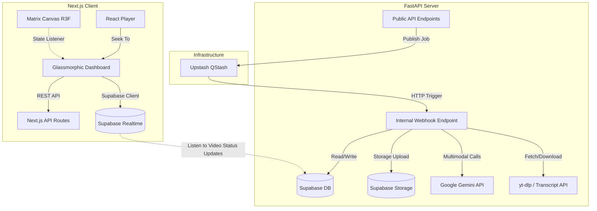

# TubeRAG Architectural Design Specification (Production-Grade & World-Class AI/Data Spec)

This document defines the production-ready architecture, database schemas, processing pipelines, and AI engineering standards for **TubeRAG**, a world-class SaaS platform enabling users to perform hybrid semantic search and Retrieval-Augmented Generation (RAG) over long-form YouTube videos.

---

## 1. System Architecture Overview

TubeRAG is architected as a high-performance monorepo:
*   **`/frontend`**: Next.js 16 (App Router) client utilizing Turbopack, Tailwind CSS, shadcn/ui, Framer Motion, and GSAP. A fixed, client-side React Three Fiber (R3F) `MatrixCanvas` renders a 3D semantic particle matrix that dynamically shifts colors in response to database changes streamed via Supabase Realtime.
*   **`/backend`**: FastAPI application optimized for FastAPI Cloud (Python 3.11+). Orchestration relies entirely on Upstash QStash to manage state transitions across serverless runs, avoiding heavy dependencies like Celery or Redis.



---

## 2. World-Class Data Engineering & Database Schema

We enable **pgvector** for vector search, utilizing Google's `text-embedding-004` (768 dimensions). To make search world-class, we combine vector search and full-text search (FTS) using a PostgreSQL **Hybrid Search Function** with **Reciprocal Rank Fusion (RRF)**.

### Database Migration Schema
```sql
-- Enable pgvector and pg_trgm extensions
create extension if not exists vector;
create extension if not exists pg_trgm;

-- Videos table
create table public.videos (
    id uuid default gen_random_uuid() primary key,
    user_id uuid references auth.users(id) on delete cascade not null,
    youtube_id varchar(255) not null,
    title text,
    channel_name varchar(255),
    duration double precision,
    thumbnail_url text,
    status varchar(50) default 'pending', -- pending, downloading, transcribing, processing_frames, completed, failed
    current_offset double precision default 0.0,
    error_message text,
    created_at timestamp with time zone default timezone('utc'::text, now()) not null,
    updated_at timestamp with time zone default timezone('utc'::text, now()) not null,
    unique(user_id, youtube_id)
);

-- Playlists table
create table public.playlists (
    id uuid default gen_random_uuid() primary key,
    user_id uuid references auth.users(id) on delete cascade not null,
    name varchar(255) not null,
    created_at timestamp with time zone default timezone('utc'::text, now()) not null,
    unique(user_id, name)
);

-- Playlist-Video Join table
create table public.playlist_videos (
    playlist_id uuid references public.playlists(id) on delete cascade not null,
    video_id uuid references public.videos(id) on delete cascade not null,
    primary key (playlist_id, video_id)
);

-- Video Chunk Embeddings (Hierarchical indexing for transcripts & slides)
create table public.video_chunks (
    id uuid default gen_random_uuid() primary key,
    video_id uuid references public.videos(id) on delete cascade not null,
    content text not null,
    fts_content tsvector generated always as (to_tsvector('english', content)) stored,
    embedding vector(768) not null,
    start_time double precision not null,
    end_time double precision not null,
    chunk_type varchar(50) not null, -- 'transcript' | 'visual_frame'
    metadata jsonb default '{}'::jsonb, -- e.g., slide title, OCR confidence, code block lines
    image_url text, -- Supabase Storage URL for visual_frame chunks
    created_at timestamp with time zone default timezone('utc'::text, now()) not null
);

-- Indexes for performance
create index on public.video_chunks using hnsw (embedding vector_cosine_ops);
create index idx_chunks_video_id on public.video_chunks(video_id);
create index idx_chunks_fts on public.video_chunks using gin(fts_content);
create index idx_chunks_metadata on public.video_chunks using gin(metadata);

-- Hybrid Search Function with Reciprocal Rank Fusion (RRF)
create or replace function hybrid_search(
    query_text text,
    query_embedding vector(768),
    target_video_id uuid,
    match_count int,
    rrf_k int default 60
)
returns table (
    chunk_id uuid,
    content text,
    start_time double precision,
    end_time double precision,
    chunk_type varchar(50),
    image_url text,
    metadata jsonb,
    combined_score double precision
)
language plpgsql
as $$
begin
    return query
    with vector_search as (
        select 
            id,
            row_number() over (order by embedding <=> query_embedding) as rank
        from public.video_chunks
        where video_id = target_video_id
        limit match_count * 2
    ),
    fts_search as (
        select 
            id,
            row_number() over (order by ts_rank_cd(fts_content, plainto_tsquery('english', query_text)) desc) as rank
        from public.video_chunks
        where video_id = target_video_id and fts_content @@ plainto_tsquery('english', query_text)
        limit match_count * 2
    )
    select 
        vc.id as chunk_id,
        vc.content,
        vc.start_time,
        vc.end_time,
        vc.chunk_type,
        vc.image_url,
        vc.metadata,
        (coalesce(1.0 / (rrf_k + vs.rank), 0.0) + coalesce(1.0 / (rrf_k + fs.rank), 0.0))::double precision as combined_score
    from public.video_chunks vc
    left join vector_search vs on vc.id = vs.id
    left join fts_search fs on vc.id = fs.id
    where vs.id is not null or fs.id is not null
    order by combined_score desc
    limit match_count;
end;
$$;
```

---

## 3. High-Fidelity Data & Ingestion Pipeline

To support video durations up to 3 hours, we implement a memory-safe, cursor-based state machine driven by QStash.

```
                  Ingest URL
                      │
                      ▼
             [POST /api/v1/ingest]
                      │
                      ▼
         Write metadata, Status='pending'
                      │
                      ▼
           Enqueue QStash: Transcribe
                      │
         ┌────────────┴────────────┐
         ▼                         ▼
   [Native Transcript]      [Audio Fallback]
   Fetch & map timestamps   Download 10m audio
         │                   Send to Gemini Audio
         │                   Parse transcription
         │                         │
         └────────────┬────────────┘
                      ▼
           Create embeddings (text-embedding-004)
                      │
                      ▼
          Enqueue QStash: Frame Sampling
                      │
                      ▼
        Loop: Download 10m Video Chunk
                      │
                      ▼
         Extract Frames (1 per 10s)
                      │
                      ▼
          Deduplicate (SSIM / MSE)
                      │
                      ▼
       Structured Gemini Slide Analysis
                      │
                      ▼
     Compress to WebP -> Supabase Storage
                      │
                      ▼
     Insert chunks, Repeat until offset > length
                      │
                      ▼
               Status='completed'
```

### 1. Time-Aware Sentence Buffer Chunker
Instead of splitting text by arbitrary word counts (which breaks sentence semantics and alignment), we group native transcript cues using a buffer:
*   **Buffer rules:**
    - Append transcript items (text, start, duration) to the buffer.
    - Flush the buffer and emit a chunk when total text size exceeds **800 characters** OR when the silent gap between the current item and the next item exceeds **3.0 seconds**.
    - Set the chunk's `start_time` to the first item's start time and `end_time` to the last item's end time.
    - This guarantees that vector search deep-linking navigates to exact sentence boundaries.

### 2. Local Frame Deduplication Pipeline
Extracting frames every 10 seconds from a 3-hour video generates **1,080 frames**. Doing 1,080 Gemini vision calls is expensive and slow.
*   **OpenCV Deduplication Filter:**
    - Convert each extracted frame to grayscale and downscale to $64 \times 64$ pixels.
    - Calculate the Structural Similarity Index Measure (SSIM) between consecutive frames.
    - If $\text{SSIM} > 0.95$, the visual layout is unchanged (e.g. static slide/code editor).
    - If a significant visual shift is detected ($\text{SSIM} \le 0.95$), mark the frame as a **Key Visual Frame** and queue it for analysis.
    - This reduces API calls by up to **85%** on slide-decks and coding tutorials.

### 3. Image Optimization & Storage
*   Key Visual Frames are compressed using Pillow (PIL) to **WebP format** (`quality=80`, target width max 1280px).
*   Upload to Supabase Storage: `video-frames/{video_id}/{timestamp}.webp`.
*   WebP compression reduces network overhead and ensures sub-second thumbnail loading on the client.

### 4. Structured Gemini Multimodal Extraction (JSON Schema)
We enforce structured outputs from Gemini to extract slide code blocks, titles, and layouts accurately:

```python
from pydantic import BaseModel, Field
from typing import List, Optional

class SlideAnalysis(BaseModel):
    slide_title: Optional[str] = Field(description="The main title or header visible on the slide")
    ocr_text: str = Field(description="All text visible on the slide, transcribed exactly")
    code_snippets: List[str] = Field(description="Any programming code blocks extracted from the screen")
    visual_description: str = Field(description="Detailed description of any charts, diagrams, or images shown")
    contains_new_content: bool = Field(description="True if this contains a new slide template or distinct layout")
```

The FastAPI backend passes this model to `client.models.generate_content`:
```python
response = client.models.generate_content(
    model="gemini-2.5-flash",
    contents=[
        types.Part.from_bytes(data=image_bytes, mime_type="image/webp"),
        "Analyze this video frame and extract slide metrics."
    ],
    config=types.GenerateContentConfig(
        response_mime_type="application/json",
        response_schema=SlideAnalysis,
    ),
)
```

---

## 4. World-Class RAG Strategy & LLM Prompting

To ensure the chatbot returns precise answers backed by citations and visuals:

### 1. Hypothetical Document Embeddings (HyDE) for Query Expansion
*   Before running vector search, Gemini generates a hypothetical answer to the user's question: *"Write a short paragraph answering this question based on technical programming slides: {user_query}"*.
*   Embed the hypothetical response using `text-embedding-004`.
*   This matches semantic density better than embedding raw user questions directly.

### 2. Context-Aware Hybrid Retrieval
*   Run the database function `hybrid_search` combining the user's query text, the HyDE embedding, the video ID, and a match limit (e.g., top 7 chunks).
*   Retrieve chunks containing both transcript sections and visual slides.

### 3. RAG Synthesis Prompt
We feed the retrieved chunks to `gemini-2.5-flash` using a strict grounding template:

```
You are TubeRAG, an elite technical assistant. Answer the user's query using only the provided video contexts.
For each statement, you MUST cite your source by appending a markdown citation link.

Context Chunks:
{formatted_context}

User Query: {user_query}

Formatting Rules:
- If citing transcript: use `[Transcript @ MM:SS](cite:transcript:seconds)`
- If citing a visual frame: use `[Slide @ MM:SS](cite:slide:seconds)`
- Do not make statements not directly supported by the context chunks.
```

---

## 5. UI Canvas & Performance Optimizations

### 1. Isolated WebGL Render Thread
*   The `MatrixCanvas.tsx` client component uses R3F (`canvas`) and disables standard frame-loop re-renders when the UI updates by setting `frameloop="demand"`.
*   We trigger paint calls manually only when:
    1. A video starts/completes processing (lighting transition).
    2. The user hovers or clicks a node in the control drawer (particles drift using GSAP).
*   This prevents CPU throttling and guarantees 60fps scrolling on the main DOM dashboard.

### 2. Glassmorphic Micro-Animations
*   All cards employ `backdrop-blur-md bg-zinc-950/40 border border-zinc-800/50`.
*   Hovering over citation badges activates an animated preview popover using Framer Motion, pre-fetching and rendering the WebP slide thumbnail from Supabase Storage.

### 3. Headless UI Stack Selection (Base UI & Radix UI)
*   **Base UI (`@base-ui/react`):** Used as the foundational headless component architecture for tabs, dialogs, and sheets. It is optimized for React 19, allows total style control using vanilla Tailwind, and avoids dependency bloating by bundling primitives into a single package.
*   **Radix UI (`@radix-ui/react-direction`):** Specifically imported to handle document bidirectionality (LTR/RTL context layout). This enables dynamic, seamless UI adjustment (reversing slides, margins, alignments) when switching between English and Arabic locales.

---

## 6. End-to-End Type Safety & CI/CD Pipeline

To ensure the monorepo remains extremely clean:
*   **Typings:** Shared JSON schema definitions or OpenAPI contracts ensure frontend Axios client calls map 1-to-1 with FastAPI Pydantic requests.
*   **Formatters:**
    - `/frontend`: Strict **Biome** linting and formatting running as a pre-commit Hook via Husky & lint-staged.
    - `/backend`: **Ruff** for linting and formatting running as a pre-commit Hook.
*   **CI Workflows:** `.github/workflows/ci.yml` runs full code formatting audits, lint checks, and typescript/pytest executions on every push.
